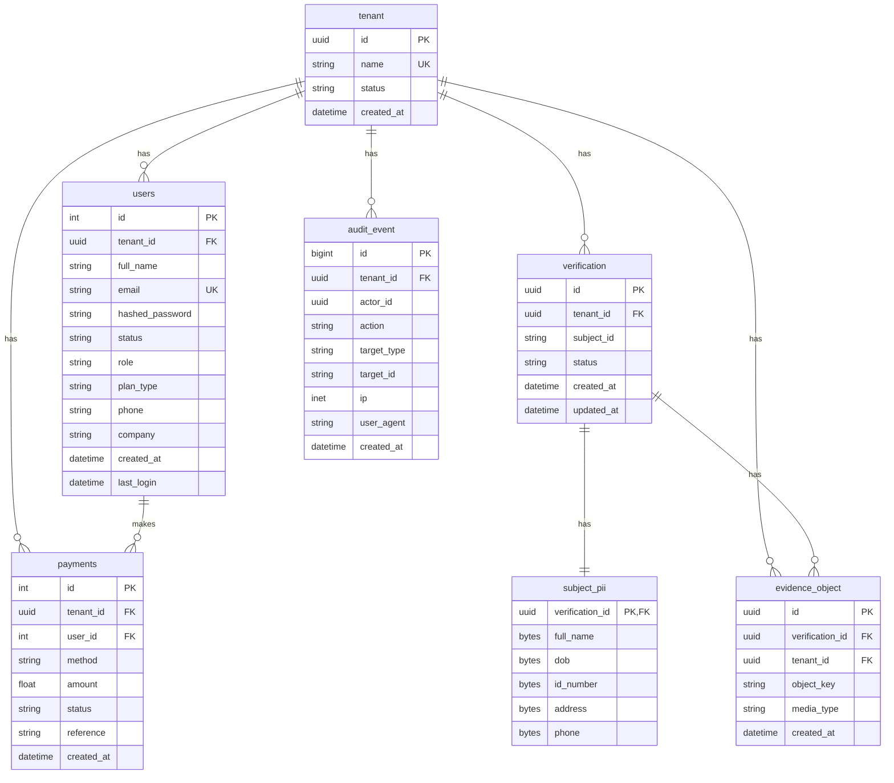

# Multi-Tenancy Technical Design

**Version**: 1.0  
**Last Updated**: August 30, 2025  
**Status**: ✅ Implemented  

## Overview

The Fayda ID Checker implements a robust multi-tenant architecture using PostgreSQL Row Level Security (RLS) for data isolation. This design ensures complete tenant separation while maintaining performance and scalability.

## Entity Relationship Diagram



## Database Schema

### Tenant Table
```sql
CREATE TABLE tenant (
    id UUID PRIMARY KEY DEFAULT gen_random_uuid(),
    name VARCHAR UNIQUE NOT NULL,
    status VARCHAR NOT NULL DEFAULT 'active',
    created_at TIMESTAMP DEFAULT NOW()
);

CREATE INDEX ix_tenant_id ON tenant(id);
CREATE INDEX ix_tenant_name ON tenant(name);
```

### Multi-Tenant Tables
All tenant-scoped tables include:
- `tenant_id UUID NOT NULL REFERENCES tenant(id)`
- Index on `tenant_id` for performance
- Composite indexes for common query patterns

## Row Level Security (RLS) Implementation

### RLS Policy Structure
```sql
-- Enable RLS on tenant-scoped tables
ALTER TABLE verification ENABLE ROW LEVEL SECURITY;
ALTER TABLE evidence_object ENABLE ROW LEVEL SECURITY;
ALTER TABLE audit_event ENABLE ROW LEVEL SECURITY;

-- Create RLS policies
CREATE POLICY verification_tenant_policy ON verification
    FOR ALL USING (tenant_id::text = current_setting('app.current_tenant', true));

CREATE POLICY evidence_object_tenant_policy ON evidence_object
    FOR ALL USING (tenant_id::text = current_setting('app.current_tenant', true));

CREATE POLICY audit_event_tenant_policy ON audit_event
    FOR ALL USING (tenant_id::text = current_setting('app.current_tenant', true));
```

### Session Context Setting
```python
# app/db/session.py
def set_tenant_context(db, tenant_id: str):
    """Set the current tenant context for RLS policies"""
    if DATABASE_URL.startswith("postgresql"):
        db.execute(text("SET LOCAL app.current_tenant = :tid"), {"tid": tenant_id})
        db.commit()
```

### FastAPI Dependency
```python
# app/deps/tenant.py
async def set_tenant_context_for_request(
    db: Session = Depends(get_db),
    tenant_id: uuid.UUID = Depends(get_current_tenant_id)
):
    """Set tenant context for RLS policies"""
    set_tenant_context(db, str(tenant_id))
    return tenant_id
```

## Index Strategy

### Primary Indexes
```sql
-- Tenant isolation indexes
CREATE INDEX ix_verification_tenant_id ON verification(tenant_id);
CREATE INDEX ix_evidence_object_tenant_id ON evidence_object(tenant_id);
CREATE INDEX ix_audit_event_tenant_id ON audit_event(tenant_id);
CREATE INDEX ix_users_tenant_id ON users(tenant_id);
CREATE INDEX ix_payments_tenant_id ON payments(tenant_id);
```

### Composite Indexes
```sql
-- Common query patterns
CREATE INDEX ix_verification_tenant_status ON verification(tenant_id, status);
CREATE INDEX ix_evidence_object_tenant_created ON evidence_object(tenant_id, created_at);
CREATE INDEX ix_audit_event_tenant_created ON audit_event(tenant_id, created_at);
CREATE INDEX ix_users_tenant_email ON users(tenant_id, email);
CREATE INDEX ix_payments_tenant_created ON payments(tenant_id, created_at);
```

### Performance Indexes
```sql
-- Lookup optimization
CREATE INDEX ix_verification_subject_id ON verification(subject_id);
CREATE INDEX ix_audit_event_actor_id ON audit_event(actor_id);
```

## Migration Strategy

### From Existing Schema
The current implementation includes migration from existing single-tenant data:

```sql
-- Create default tenant
INSERT INTO tenant (id, name, status, created_at) 
VALUES (gen_random_uuid(), 'default', 'active', now())
ON CONFLICT (name) DO NOTHING;

-- Get default tenant ID
SELECT id FROM tenant WHERE name = 'default';

-- Update existing records with default tenant
UPDATE users SET tenant_id = 'default_tenant_uuid' WHERE tenant_id IS NULL;
UPDATE payments SET tenant_id = 'default_tenant_uuid' WHERE tenant_id IS NULL;

-- Make tenant_id NOT NULL after data migration
ALTER TABLE users ALTER COLUMN tenant_id SET NOT NULL;
ALTER TABLE payments ALTER COLUMN tenant_id SET NOT NULL;
```

## API Implementation

### Tenant Context Middleware
```python
# app/middleware/tenant_context.py
from fastapi import Request
from app.deps.tenant import set_tenant_context_for_request

async def tenant_context_middleware(request: Request, call_next):
    """Automatically set tenant context for all requests"""
    # Extract tenant from JWT or subdomain
    tenant_id = extract_tenant_from_request(request)
    
    # Set tenant context
    await set_tenant_context_for_request(tenant_id)
    
    response = await call_next(request)
    return response
```

### Tenant Extraction Strategies
```python
def extract_tenant_from_request(request: Request) -> str:
    """Extract tenant ID from request"""
    # Strategy 1: JWT token
    token = request.headers.get("Authorization")
    if token:
        payload = jwt.decode(token, SECRET_KEY, algorithms=[ALGORITHM])
        return payload.get("tenant_id")
    
    # Strategy 2: Subdomain
    host = request.headers.get("host", "")
    if ".tenant." in host:
        subdomain = host.split(".")[0]
        return get_tenant_id_from_subdomain(subdomain)
    
    # Strategy 3: Header
    return request.headers.get("X-Tenant-ID")
```

## Security Considerations

### Tenant Isolation
- **RLS Policies**: All tenant-scoped queries automatically filtered
- **Session Context**: Tenant context set per request
- **No Cross-Tenant Access**: Impossible to access other tenant data

### Data Validation
```python
def validate_tenant_access(user_tenant_id: UUID, resource_tenant_id: UUID):
    """Validate user has access to tenant resource"""
    if user_tenant_id != resource_tenant_id:
        raise HTTPException(
            status_code=403,
            detail="Access denied: cross-tenant access not allowed"
        )
```

### Audit Logging
```python
def log_tenant_operation(
    db: Session,
    tenant_id: UUID,
    actor_id: UUID,
    action: str,
    target_type: str,
    target_id: str
):
    """Log tenant-scoped operations"""
    audit_event = AuditEvent(
        tenant_id=tenant_id,
        actor_id=actor_id,
        action=action,
        target_type=target_type,
        target_id=target_id,
        ip=request.client.host,
        user_agent=request.headers.get("user-agent")
    )
    db.add(audit_event)
    db.commit()
```

## Performance Optimization

### Connection Pooling
```python
# app/db/session.py
engine = create_engine(
    DATABASE_URL,
    pool_pre_ping=True,
    pool_recycle=300,
    pool_size=20,
    max_overflow=30
)
```

### Query Optimization
```python
# Optimized tenant-scoped queries
def get_verifications_by_tenant(db: Session, tenant_id: UUID, limit: int = 100):
    return db.query(Verification)\
        .filter(Verification.tenant_id == tenant_id)\
        .order_by(Verification.created_at.desc())\
        .limit(limit)\
        .all()
```

### Caching Strategy
```python
# Tenant-aware caching
def get_tenant_cache_key(tenant_id: UUID, key: str) -> str:
    return f"tenant:{tenant_id}:{key}"

# Cache tenant-specific data
@cache(expire=300)
def get_tenant_config(tenant_id: UUID):
    cache_key = get_tenant_cache_key(tenant_id, "config")
    return redis.get(cache_key)
```

## Testing Strategy

### Unit Tests
```python
# tests/test_multi_tenancy.py
def test_tenant_isolation(db_session: Session):
    """Test that tenants are properly isolated"""
    # Create two tenants
    tenant1 = Tenant(name="tenant1", status="active")
    tenant2 = Tenant(name="tenant2", status="active")
    
    # Create users in different tenants
    user1 = User(tenant_id=tenant1.id, email="user1@test.com")
    user2 = User(tenant_id=tenant2.id, email="user2@test.com")
    
    # Verify isolation
    assert user1.tenant_id != user2.tenant_id
```

### Integration Tests
```python
def test_rls_policy_enforcement(client, tenant1_user, tenant2_user):
    """Test RLS policy enforcement"""
    # Set tenant context for tenant1
    client.headers["X-Tenant-ID"] = str(tenant1_user.tenant_id)
    
    # Should only see tenant1 data
    response = client.get("/api/verifications")
    assert all(v["tenant_id"] == str(tenant1_user.tenant_id) 
               for v in response.json())
```

## Monitoring & Observability

### Tenant Metrics
```python
# app/core/monitoring.py
def track_tenant_operation(tenant_id: UUID, operation: str, duration: float):
    """Track tenant-specific metrics"""
    prometheus_client.Counter(
        'tenant_operations_total',
        ['tenant_id', 'operation']
    ).inc()
    
    prometheus_client.Histogram(
        'tenant_operation_duration_seconds',
        ['tenant_id', 'operation']
    ).observe(duration)
```

### Tenant Health Checks
```python
@app.get("/health/tenant/{tenant_id}")
def tenant_health_check(tenant_id: UUID):
    """Check tenant-specific health"""
    # Verify tenant exists and is active
    tenant = db.query(Tenant).filter(Tenant.id == tenant_id).first()
    if not tenant or tenant.status != "active":
        raise HTTPException(status_code=404, detail="Tenant not found")
    
    return {"status": "healthy", "tenant_id": str(tenant_id)}
```

## Future Enhancements

### Tenant Provisioning
- Automated tenant creation workflow
- Tenant configuration templates
- Multi-region tenant deployment

### Advanced Isolation
- Database-per-tenant option for high-security requirements
- Cross-tenant data sharing with explicit permissions
- Tenant-specific feature flags

### Performance Scaling
- Tenant-specific connection pools
- Tenant-aware caching strategies
- Horizontal scaling per tenant

## Conclusion

The multi-tenancy implementation provides robust data isolation while maintaining performance and scalability. The RLS-based approach ensures security at the database level, while the FastAPI integration provides a clean developer experience.

Key benefits:
- **Security**: Complete tenant isolation with RLS
- **Performance**: Optimized indexes and query patterns
- **Scalability**: Horizontal scaling support
- **Maintainability**: Clean separation of concerns
- **Compliance**: Audit trail for all tenant operations
