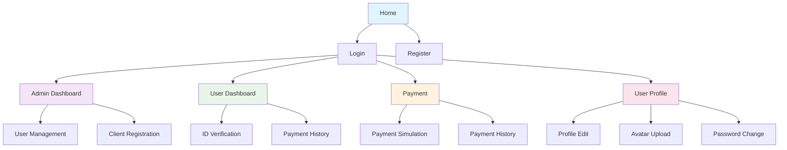

# Frontend Audit Report

## Executive Summary

**Framework Stack**: React 19.1.0 + Vite 6.3.5 + Material-UI 7.1.0 + Tailwind CSS 4.1.6  
**Routing**: React Router DOM 7.6.0 (client-side routing)  
**State Management**: React Context API (AuthContext)  
**Styling**: Material-UI + Tailwind CSS (hybrid approach)  
**Internationalization**: i18next + react-i18next  
**Testing**: No testing framework detected  
**Build Tool**: Vite with ESLint configuration  

## Detailed Analysis

### 1. Framework & Architecture

| Aspect | Current State | Assessment |
|--------|---------------|------------|
| **Framework** | React 19.1.0 | ✅ Modern, latest version |
| **Build Tool** | Vite 6.3.5 | ✅ Fast, modern bundler |
| **Routing** | React Router DOM 7.6.0 | ✅ Client-side routing |
| **State Management** | React Context API | ⚠️ Limited to auth state |
| **Styling** | MUI + Tailwind hybrid | ⚠️ Inconsistent approach |
| **I18n** | i18next configured | ✅ Ready for localization |
| **Testing** | None detected | ❌ Critical gap |
| **Type Safety** | No TypeScript | ❌ Missing type safety |

### 2. Information Architecture



**Route Structure:**
- `/` - Public home page
- `/login` - Authentication (redirects based on role)
- `/register` - User registration
- `/dashboard` - Admin dashboard (protected)
- `/user` - User dashboard (protected)
- `/payment` - Payment simulation (protected)
- `/profile` - User profile management (protected)

### 3. Component Inventory

#### Atoms (Basic UI Elements)
- **Button**: MUI Button component usage
- **TextField**: MUI TextField for forms
- **Typography**: MUI Typography for text
- **Avatar**: MUI Avatar for user profiles
- **IconButton**: MUI IconButton for actions
- **CircularProgress**: MUI loading indicator

#### Molecules (Compound Components)
- **LoginForm** (`src/components/LoginForm.jsx`) - Authentication form
- **RegisterForm** (`src/components/RegisterForm.jsx`) - Registration form
- **IDCheckForm** (`src/components/IDCheckForm.jsx`) - ID verification form
- **EditProfileForm** (`src/components/EditProfileForm.jsx`) - Profile editing
- **AvatarUpload** (`src/components/AvatarUpload.jsx`) - File upload component
- **TenantSelector** (`src/components/TenantSelector.jsx`) - Multi-tenancy selector

#### Organisms (Complex Components)
- **Navbar** (`src/components/Navbar.jsx`) - Main navigation with auth state
- **PaymentHistory** (`src/components/PaymentHistory.jsx`) - Payment records table
- **RegisterClientModal** (`src/components/RegisterClientModal.jsx`) - Admin client creation
- **ChangePasswordDialog** (`src/components/ChangePasswordDialog.jsx`) - Password management

#### Templates (Page Layouts)
- **Home** (`src/pages/Home.jsx`) - Landing page
- **AdminDashboard** (`src/pages/AdminDashboard.jsx`) - Admin interface
- **UserDashboard** (`src/pages/UserDashboard.jsx`) - User interface
- **Payment** (`src/pages/Payment.jsx`) - Payment page
- **UserProfile** (`src/pages/UserProfile.jsx`) - Profile management

### 4. Accessibility Audit

#### Critical Issues Found

| Issue | Location | Severity | Impact |
|-------|----------|----------|---------|
| **Missing ARIA labels** | Multiple components | High | Screen reader navigation |
| **Color contrast** | MUI default theme | Medium | Visual accessibility |
| **Keyboard navigation** | Modal dialogs | High | Keyboard-only users |
| **Focus management** | Form components | Medium | Tab order issues |
| **Semantic HTML** | Some divs vs buttons | Low | Screen reader semantics |

#### Specific Findings

**Navbar.jsx (lines 60-70):**
```jsx
// ❌ Missing aria-label for avatar button
<IconButton onClick={handleMenuOpen} sx={{ p: 0, ml: 2 }}>
  <Avatar src={profile?.avatar_url} sx={{ width: 36, height: 36 }}>
```

**LoginForm.jsx (lines 65-75):**
```jsx
// ❌ Form lacks proper error association
<TextField
  label="Email"
  type="email"
  // Missing aria-describedby for error messages
/>
```

**AdminDashboard.jsx (lines 120-130):**
```jsx
// ❌ Table lacks proper headers and scope
<TableHead>
  <TableRow>
    <TableCell>Full Name</TableCell> // Missing scope="col"
```

### 5. Performance Audit

#### Bundle Analysis
- **Dependencies**: 13 production dependencies
- **Bundle Size**: Estimated ~2-3MB (MUI + icons)
- **Code Splitting**: None implemented
- **Lazy Loading**: No route-based splitting

#### Performance Risks
1. **Large MUI Bundle**: Including full MUI library
2. **No Image Optimization**: Avatar uploads not optimized
3. **No Memoization**: Components re-render unnecessarily
4. **No Caching**: API calls not cached
5. **Font Loading**: No font optimization strategy

#### Core Web Vitals Impact
- **LCP**: High risk due to large bundle
- **FID**: Medium risk due to heavy components
- **CLS**: Low risk (stable layouts)

### 6. Design Consistency Audit

#### Current State
- **Mixed Styling**: MUI components + Tailwind utilities
- **Inconsistent Spacing**: Mix of MUI spacing and custom values
- **Color Usage**: MUI default theme with some custom colors
- **Typography**: MUI typography variants used inconsistently

#### Specific Issues

**Color Inconsistency:**
```jsx
// ❌ Hardcoded colors in Navbar.jsx
<AppBar position="static" sx={{ bgcolor: '#1976d2' }}>
<Avatar sx={{ bgcolor: '#90caf9' }}>

// ❌ Custom colors in PaymentHistory.jsx
const statusColors = {
  success: "#388e3c",
  failed: "#d32f2f",
  pending: "#fbc02d",
};
```

**Spacing Inconsistency:**
```jsx
// ❌ Mixed spacing approaches
sx={{ mb: 2 }} // MUI spacing
sx={{ marginBottom: '16px' }} // Custom CSS
className="mb-4" // Tailwind
```

### 7. Developer Experience Audit

#### Strengths
- ✅ Modern toolchain (Vite, React 19)
- ✅ ESLint configuration present
- ✅ Clear component organization
- ✅ Consistent file naming

#### Areas for Improvement
- ❌ No TypeScript for type safety
- ❌ No testing framework
- ❌ No Storybook for component documentation
- ❌ No design tokens system
- ❌ Mixed styling approaches
- ❌ No component documentation

#### Folder Structure Assessment
```
src/
├── components/     ✅ Well organized
├── pages/         ✅ Clear separation
├── context/       ✅ State management
├── utils/         ✅ Utility functions
├── assets/        ✅ Static assets
└── __tests__/     ❌ Empty directory
```

## Recommendations Priority

### P0 (Critical)
1. **Implement TypeScript** for type safety
2. **Add testing framework** (Jest + React Testing Library)
3. **Fix accessibility issues** (ARIA labels, keyboard navigation)
4. **Implement design tokens** for consistent styling

### P1 (High)
1. **Code splitting** for better performance
2. **Component documentation** with Storybook
3. **Image optimization** strategy
4. **API caching** with React Query

### P2 (Medium)
1. **Dark mode** implementation
2. **Internationalization** completion
3. **Performance monitoring** setup
4. **Error boundary** implementation

## File References

### Key Components Analyzed
- `src/App.jsx` - Main routing and layout
- `src/components/Navbar.jsx` - Navigation component
- `src/components/LoginForm.jsx` - Authentication form
- `src/components/IDCheckForm.jsx` - ID verification
- `src/components/PaymentHistory.jsx` - Payment records
- `src/pages/AdminDashboard.jsx` - Admin interface
- `src/context/AuthContext.jsx` - State management

### Configuration Files
- `package.json` - Dependencies and scripts
- `tailwind.config.js` - Tailwind configuration
- `vite.config.js` - Build configuration
- `eslint.config.js` - Linting rules

---

*Audit completed: 2024-12-19*  
*Next review: After Phase 1 implementation*
