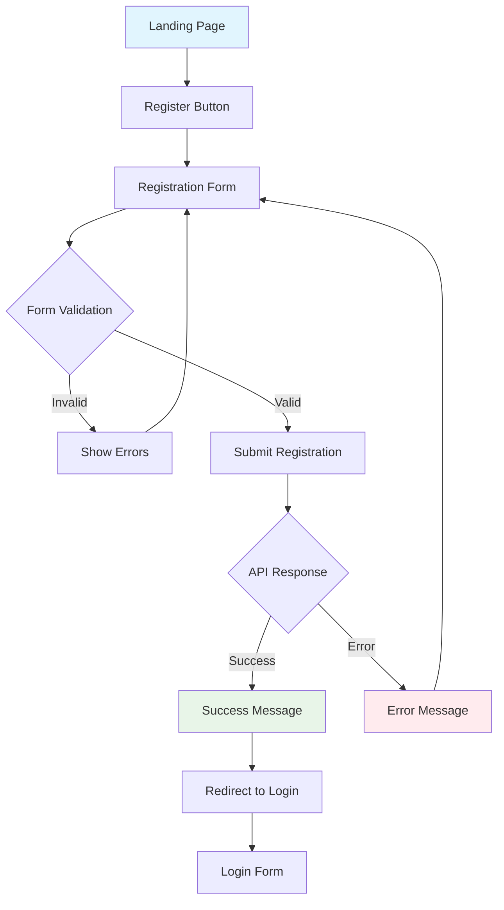
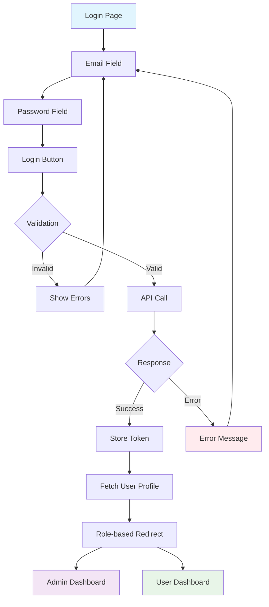
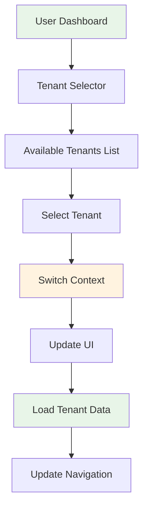
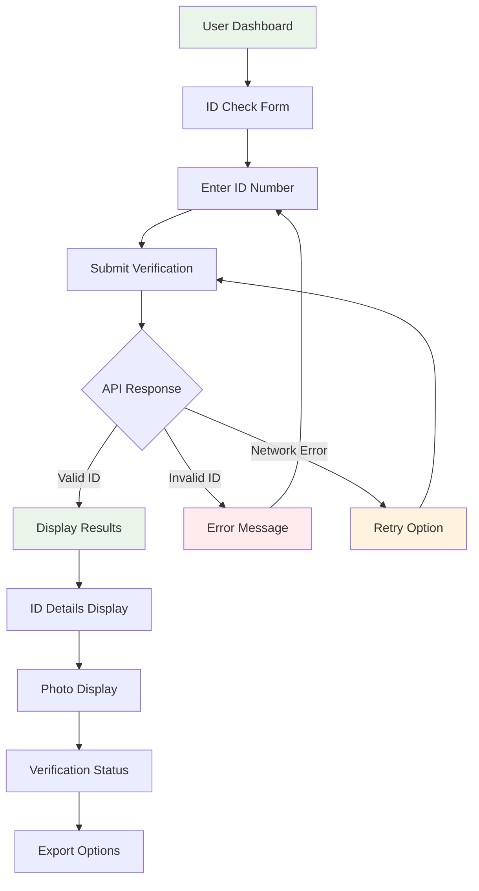
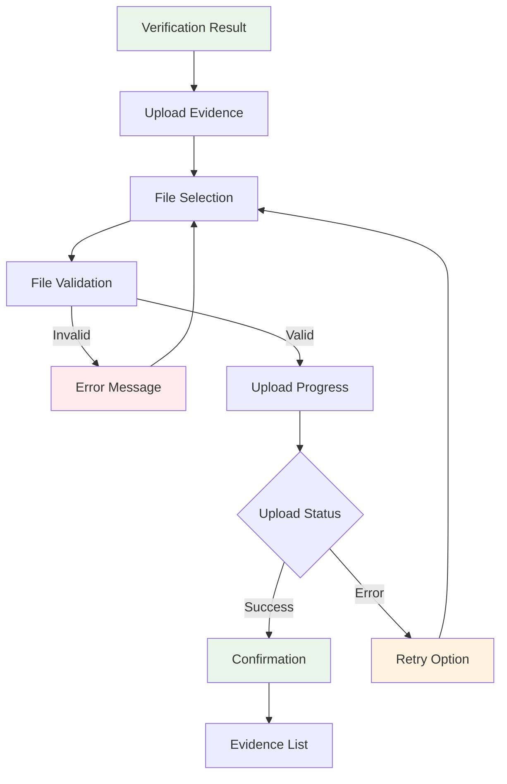
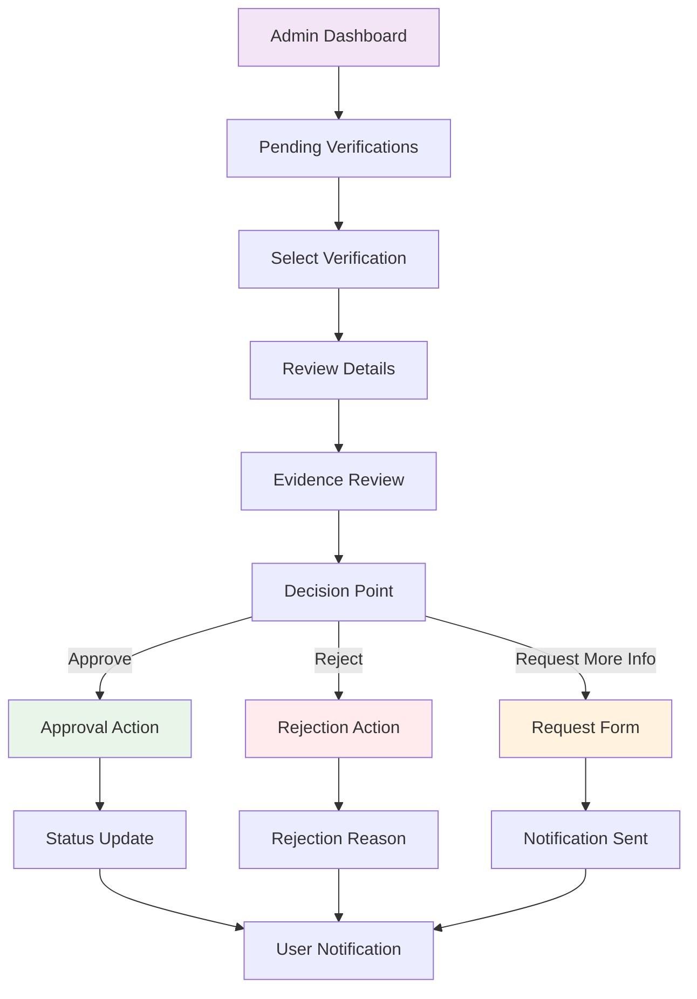
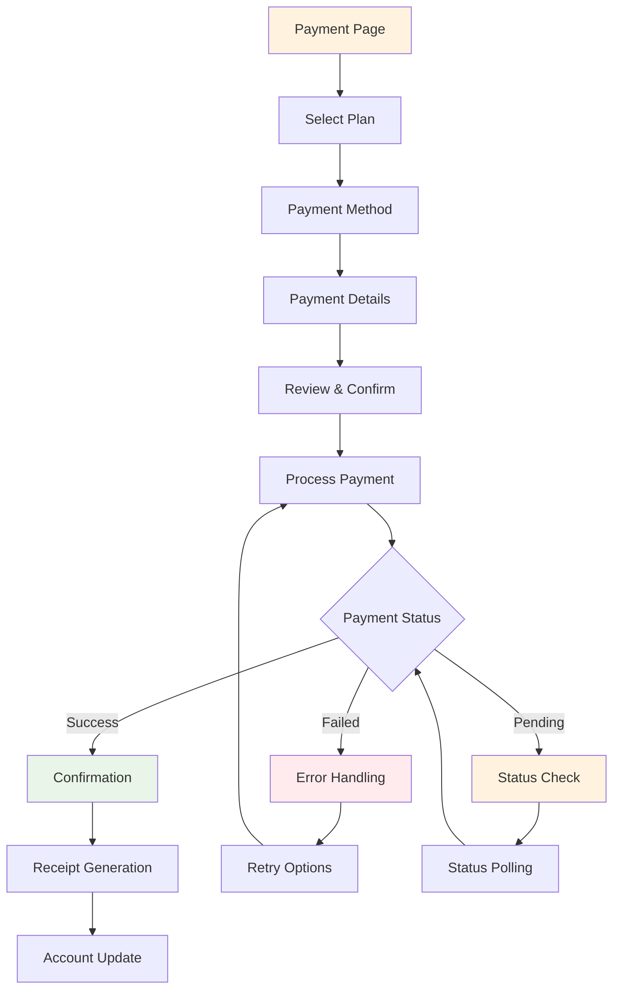
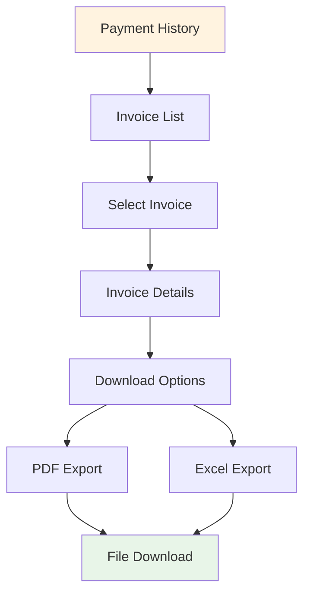
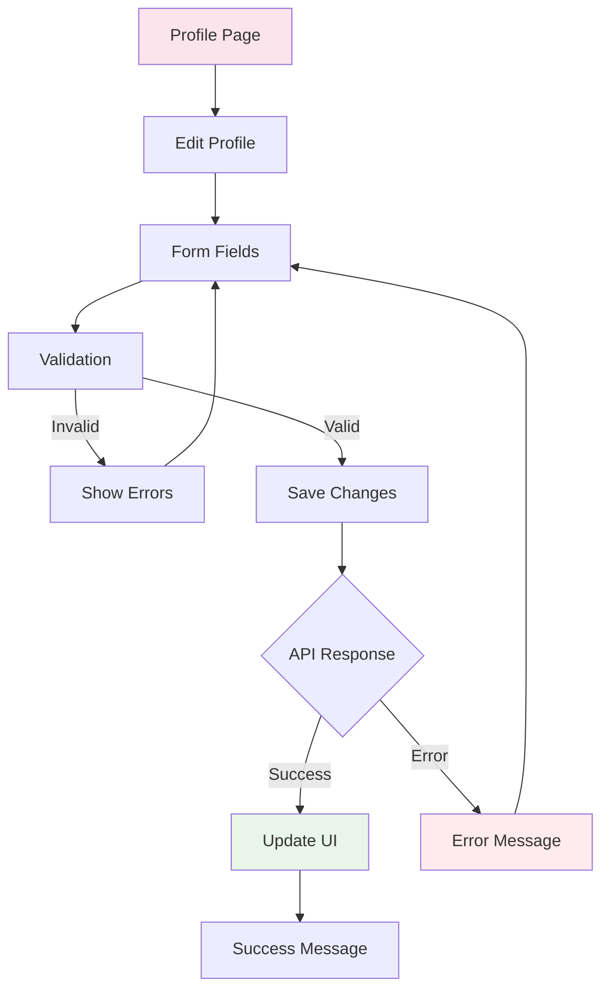
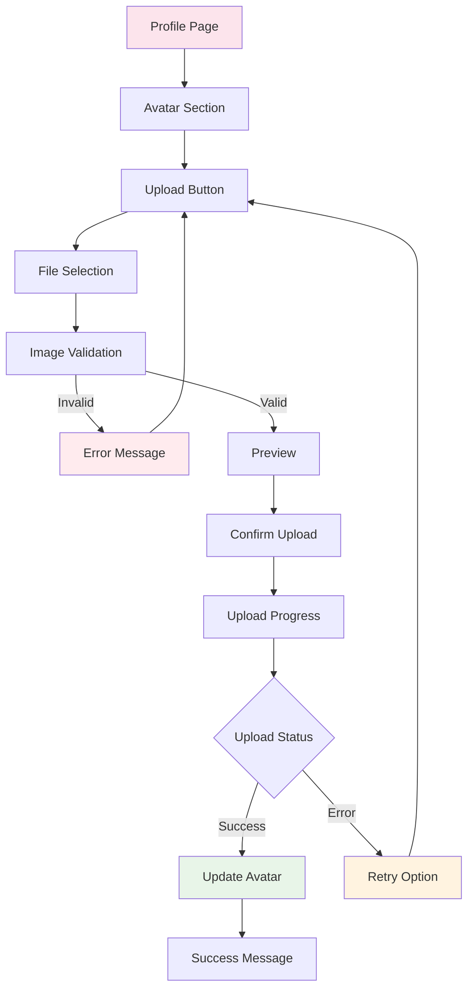

# UX Flows

## Overview

This document defines the key user experience flows for the Fayda ID Checker application. Each flow includes step-by-step diagrams, entry points, success/error handling, and acceptance criteria.

## 1. Authentication Flow

### User Registration


**Entry Points:**
- Landing page "Register" button
- Login page "Register" link

**Steps:**
1. User clicks "Register" button
2. Registration form loads with fields:
   - Full Name (required)
   - Email (required, validated)
   - Password (required, min 8 chars)
   - Confirm Password (required, must match)
   - Phone Number (optional)
   - Organization (optional)
3. Real-time validation feedback
4. Submit button (disabled until valid)
5. Success/error message display
6. Redirect to login on success

**Success Messages:**
- "Registration successful! Please check your email to verify your account."
- "Account created successfully. You can now log in."

**Error Messages:**
- "Email already exists. Please use a different email or try logging in."
- "Password must be at least 8 characters long."
- "Passwords do not match. Please try again."

**Acceptance Criteria:**
- Form validates all required fields
- Email format validation
- Password strength requirements
- Clear error messages with field highlighting
- Success confirmation before redirect

### User Login


**Entry Points:**
- Landing page "Login" button
- Protected route redirect
- Registration success redirect

**Steps:**
1. User enters email and password
2. Form validation (email format, required fields)
3. Submit button (disabled if invalid)
4. Loading state during API call
5. Token storage on success
6. User profile fetch
7. Role-based navigation:
   - Admin → `/dashboard`
   - User/Client → `/user`

**Success States:**
- Token stored in localStorage
- User profile loaded
- Navigation to appropriate dashboard
- Welcome message with user name

**Error States:**
- "Invalid email or password. Please try again."
- "Account is locked. Please contact support."
- "Network error. Please check your connection."

**Acceptance Criteria:**
- Email format validation
- Password field masking
- Loading state during authentication
- Secure token storage
- Proper role-based routing
- Clear error messaging

## 2. Multi-Tenancy Flow

### Tenant Selection


**Entry Points:**
- User dashboard (if user has multiple tenants)
- Profile settings
- Admin user management

**Steps:**
1. Tenant selector dropdown appears
2. List of available tenants displayed
3. Current tenant highlighted
4. Click to switch tenant
5. Context update with loading state
6. UI refresh with new tenant data
7. Navigation updates if needed

**Success Messages:**
- "Switched to [Tenant Name] successfully"
- "Context updated to [Tenant Name]"

**Error Messages:**
- "Failed to switch tenant. Please try again."
- "You don't have access to this tenant."

**Acceptance Criteria:**
- Clear tenant identification
- Smooth context switching
- Loading states during transition
- Proper access control validation

## 3. KYC Submission Flow

### ID Verification Process


**Entry Points:**
- User dashboard "ID Verification" section
- Direct navigation to `/user` with ID check form

**Steps:**
1. User navigates to ID verification
2. Form with ID number input field
3. Submit button (disabled if empty)
4. Loading state during API call
5. Results display:
   - Valid ID: Name, DOB, photo, status
   - Invalid ID: Error reason
6. Export options (PDF, Excel)

**Success States:**
- "✅ ID is valid!"
- Display of ID holder information
- Photo display (if available)
- Export functionality

**Error States:**
- "❌ Invalid ID: [specific reason]"
- "❌ Failed to check ID. Are you logged in as a user?"
- "Network error. Please try again."

**Acceptance Criteria:**
- Clear input validation
- Loading states during verification
- Comprehensive result display
- Export functionality
- Proper error handling

### Evidence Upload Flow


**Entry Points:**
- After successful ID verification
- Evidence management section

**Steps:**
1. User clicks "Upload Evidence"
2. File picker opens
3. File validation (type, size, format)
4. Upload progress indicator
5. Success confirmation
6. Evidence list update

**File Requirements:**
- Supported formats: JPG, PNG, PDF
- Maximum size: 10MB
- Clear naming convention

**Success Messages:**
- "Evidence uploaded successfully"
- "File [filename] added to verification"

**Error Messages:**
- "File type not supported. Please use JPG, PNG, or PDF."
- "File too large. Maximum size is 10MB."
- "Upload failed. Please try again."

**Acceptance Criteria:**
- File type validation
- Size limit enforcement
- Progress indication
- Clear success/error feedback
- Evidence list management

## 4. Review & Approval Flow

### Admin Review Process


**Entry Points:**
- Admin dashboard "Pending Reviews" section
- Email notifications
- Direct verification links

**Steps:**
1. Admin views pending verifications list
2. Click on verification to review
3. Review ID details and evidence
4. Make decision:
   - Approve: One-click approval
   - Reject: Provide reason
   - Request more info: Send message
5. Status update and notification

**Approval Actions:**
- Instant status change to "Approved"
- Email notification to user
- Audit trail creation

**Rejection Actions:**
- Status change to "Rejected"
- Reason required
- Email notification with details
- Appeal process information

**Request More Info:**
- Status change to "Pending Additional Info"
- Message to user
- Timeline for response

**Acceptance Criteria:**
- Clear review interface
- Evidence preview capability
- Decision tracking
- Automated notifications
- Audit trail maintenance

## 5. Billing & Payment Flow

### Payment Processing


**Entry Points:**
- Payment page `/payment`
- Billing dashboard
- Plan upgrade prompts

**Steps:**
1. User selects payment plan
2. Choose payment method:
   - Telebirr
   - Stripe (credit card)
   - MockPay (testing)
3. Enter payment details
4. Review order summary
5. Confirm payment
6. Process payment with loading state
7. Handle response and update account

**Payment Methods:**
- **Telebirr**: Mobile money integration
- **Stripe**: Credit/debit card processing
- **MockPay**: Test payment simulation

**Success Flow:**
- Payment confirmation
- Receipt generation
- Account status update
- Email confirmation
- Redirect to dashboard

**Error Handling:**
- Payment failure messages
- Retry options
- Alternative payment methods
- Support contact information

**Acceptance Criteria:**
- Multiple payment method support
- Secure payment processing
- Clear confirmation flow
- Receipt generation
- Account status updates

### Invoice Management


**Entry Points:**
- Payment history section
- Email invoice links
- Dashboard billing section

**Steps:**
1. View payment history table
2. Filter by date, method, status
3. Click on invoice for details
4. Download options:
   - PDF format
   - Excel format
5. File download confirmation

**Export Features:**
- PDF with company branding
- Excel with data analysis
- Batch export capabilities

**Acceptance Criteria:**
- Comprehensive payment history
- Multiple export formats
- Filtering and search
- Professional invoice formatting

## 6. User Profile Management

### Profile Update Flow


**Entry Points:**
- Profile page `/profile`
- Navbar avatar dropdown
- Settings section

**Steps:**
1. User clicks "Edit Profile"
2. Form loads with current data
3. Editable fields:
   - Full Name
   - Email (read-only)
   - Phone Number
   - Organization
4. Real-time validation
5. Save button (disabled if invalid)
6. Success/error feedback

**Success Messages:**
- "Profile updated successfully"
- "Changes saved"

**Error Messages:**
- "Failed to update profile. Please try again."
- "Email cannot be changed. Contact support if needed."

**Acceptance Criteria:**
- Pre-populated form data
- Real-time validation
- Clear success/error feedback
- Proper field restrictions

### Avatar Upload Flow


**Entry Points:**
- Profile page avatar section
- Avatar hover menu

**Steps:**
1. Click avatar or upload button
2. File picker opens
3. Image validation:
   - Format: JPG, PNG
   - Size: Max 5MB
   - Dimensions: Min 100x100px
4. Preview image
5. Confirm upload
6. Progress indicator
7. Update avatar display

**Success Messages:**
- "Avatar updated successfully"
- "Profile picture changed"

**Error Messages:**
- "Image format not supported. Please use JPG or PNG."
- "Image too large. Maximum size is 5MB."
- "Upload failed. Please try again."

**Acceptance Criteria:**
- Image format validation
- Size limit enforcement
- Preview functionality
- Progress indication
- Immediate UI update

## Microcopy Guidelines

### General Principles
- **Concise**: Keep messages brief and clear
- **Inclusive**: Use gender-neutral language
- **Helpful**: Provide actionable guidance
- **Professional**: Maintain formal tone
- **Multilingual**: Support EN + Amharic/Afan Oromo/Tigrinya

### Button Labels
- Primary actions: "Save", "Submit", "Confirm"
- Secondary actions: "Cancel", "Back", "Close"
- Destructive actions: "Delete", "Remove", "Cancel"
- Loading states: "Saving...", "Processing...", "Loading..."

### Form Labels
- Clear and descriptive: "Full Name", "Email Address"
- Required indicators: "Email Address *"
- Helper text: "Enter your business email address"
- Error messages: "Please enter a valid email address"

### Success Messages
- Confirm action completion
- Provide next steps when relevant
- Use positive, encouraging tone

### Error Messages
- Explain what went wrong
- Provide specific guidance
- Offer solutions when possible
- Avoid technical jargon

### Loading States
- Indicate what's happening
- Provide progress when possible
- Set appropriate expectations

### Multilingual Placeholders
```javascript
// English
"Enter your full name"

// Amharic
"ሙሉ ስምዎን ያስገቡ"

// Afan Oromo
"Maqaa keessan guutuu galchi"

// Tigrinya
"ምሉእ ስምኩም ኣእትዉ"
```

---

*UX Flows v1.0 - Last updated: 2024-12-19*
